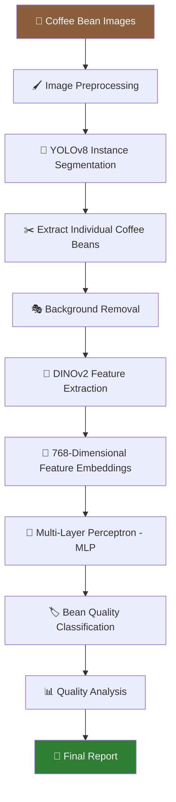
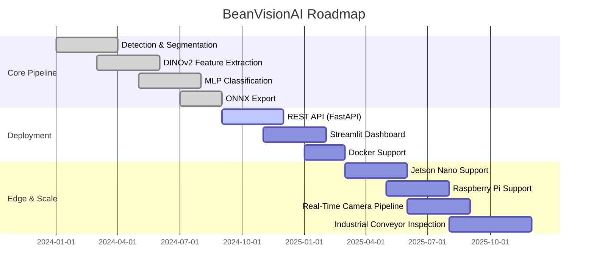

<div align="center">
# ☕ BeanVisionAI
 
### AI-Powered Coffee Bean Quality Assessment System
 
**A state-of-the-art open-source deep learning framework for automated coffee bean detection, segmentation, feature extraction, and quality classification.**
 
[](https://www.python.org/)
[](https://pytorch.org/)
[](https://github.com/ultralytics/ultralytics)
[](LICENSE)
[](CONTRIBUTING.md)
[](https://github.com/psf/black)
 
BeanVisionAI
AI-Powered Coffee Bean Quality Assessment System


An Open-Source Deep Learning Framework for Intelligent Coffee Bean Quality Assessment

"Combining Computer Vision, Vision Transformers, and Deep Learning to automate coffee bean inspection."

---
 
## 📚 Table of Contents
 
- [☕ BeanVisionAI](#-beanvisionai)
- [🌟 Overview](#-overview)
- [💡 Motivation](#-motivation)
- [✨ Features](#-features)
- [🧠 AI Pipeline](#-ai-pipeline)
- [🏗️ Architecture Diagram](#️-architecture-diagram)
- [🛠️ Technology Stack](#️-technology-stack)
- [🔬 Core Components Explained](#-core-components-explained)
  - [YOLOv8 — Detection & Segmentation](#1-yolov8--detection--instance-segmentation)
  - [DINOv2 — Self-Supervised Feature Extraction](#2-dinov2--self-supervised-feature-extraction)
  - [MLP — Classification Head](#3-multi-layer-perceptron-mlp--classification-head)
  - [OpenCV — Image Processing](#4-opencv--classical-image-processing)
  - [PyTorch — Deep Learning Backbone](#5-pytorch--deep-learning-framework)
  - [ONNX — Deployment & Interoperability](#6-onnx--cross-platform-deployment)
- [⚙️ Installation](#️-installation)
- [🚀 Quick Start](#-quick-start)
- [🗂️ Dataset](#️-dataset)
- [📁 Folder Structure](#-folder-structure)
- [🏋️ Training](#️-training)
- [🔍 Inference](#-inference)
- [📏 Evaluation](#-evaluation)
- [📈 Metrics](#-metrics)
- [📊 Model Performance](#-model-performance)
- [🖼️ Screenshots](#️-screenshots)
- [🔮 Example Predictions](#-example-predictions)
- [📤 Example Output](#-example-output)
- [🗺️ Roadmap](#️-roadmap)
- [🔭 Future Scope](#-future-scope)
- [🤝 Contributing](#-contributing)
- [📜 Code of Conduct](#-code-of-conduct)
- [📖 Citation](#-citation)
- [📄 License](#-license)
- [🙏 Acknowledgements](#-acknowledgements)
- [👤 Author](#-author)
- [📬 Contact](#-contact)
- [💖 Support](#-support)
- [⭐ Star History](#-star-history)
---
 
## 🌟 Overview
 
**BeanVisionAI** is an end-to-end, research-grade computer vision framework built to automate one of the most labor-intensive and subjective processes in the coffee industry: **quality grading of raw coffee beans**.
 
Traditionally, coffee bean grading (commonly known as *cupping* and *manual sorting*) is performed by trained human graders who visually inspect beans for size, color, shape, and surface defects. This process is:
 
- ⏳ **Time-consuming** — manual sorting of large batches takes hours
- 🎯 **Subjective** — grading quality varies between individual graders
- 💰 **Expensive** — requires specialized, trained labor
- 📉 **Difficult to scale** — cannot easily scale with increasing production volumes
BeanVisionAI addresses these limitations by combining **modern instance segmentation**, **self-supervised vision transformers**, and **lightweight classification heads** into a single, cohesive, reproducible pipeline — from raw image capture to a structured quality report.
 
The system is built with **modularity** and **extensibility** as first-class citizens, meaning every stage of the pipeline (detection, segmentation, feature extraction, classification, and reporting) can be swapped, retrained, or extended independently.
 
> 💬 **In short:** Feed BeanVisionAI a photo of coffee beans, and it detects each bean, isolates it, extracts deep visual features, classifies its quality grade, flags defects, and produces a structured report — automatically.
 
---
 
## 💡 Motivation
 
Coffee is one of the most traded agricultural commodities in the world, and bean quality directly determines market price, brand reputation, and consumer satisfaction. Despite this, quality control at the farm, cooperative, and processing-facility level is still largely manual in most producing regions.
 
BeanVisionAI was created to:
 
- 🌾 Bring **AI-assisted quality control** to smallholder farms and cooperatives, not just large industrial processors
- 🔬 Provide **researchers** with an open, reproducible benchmark pipeline for agricultural computer vision
- 🏭 Offer **industrial automation teams** a reference implementation that can be adapted to conveyor-belt and edge deployments
- 🎓 Serve as an **educational resource** for combining modern segmentation models (YOLOv8) with self-supervised representation learning (DINOv2) in a real-world applied setting
- 🌍 Lower the barrier to entry for **AI-driven agri-tech** by keeping the entire stack open-source and well-documented
We believe agricultural AI tooling should be as polished, transparent, and community-driven as tooling in other domains like NLP or general computer vision — and BeanVisionAI is our contribution toward that goal.
 
---
 
## ✨ Features
 
### ✅ Currently Implemented
 
| Feature | Description |
|---|---|
| ☕ **Coffee Bean Detection** | Robust detection of individual beans in cluttered, overlapping arrangements |
| 🧩 **Instance Segmentation** | Pixel-precise masks for every detected bean using YOLOv8-seg |
| ✂️ **Bean Extraction** | Automatic cropping of each segmented bean into an individual image |
| 🎭 **Background Removal** | Clean, mask-based background removal for isolated bean imagery |
| 🧬 **DINOv2 Feature Extraction** | 768-dimensional embeddings capturing rich visual semantics |
| 🧠 **MLP Classification** | Lightweight classifier mapping embeddings to quality grades |
| 📏 **Evaluation Pipeline** | Standardized scripts for precision, recall, F1, and confusion matrices |
| 🏋️ **Model Training** | Configurable training scripts for segmentation and classification stages |
| 🔍 **Model Inference** | Single-image and batch inference support |
| 📊 **Visualization** | Overlay visualizations for detections, masks, and predicted classes |
| 📦 **ONNX Export** | Export trained models for cross-platform, hardware-accelerated inference |
 
### 🧭 Planned / In Progress
 
| Feature | Description |
|---|---|
| 🌐 **REST API** | FastAPI-based service for programmatic access to the pipeline |
| 📺 **Streamlit Dashboard** | Interactive web UI for uploading images and viewing reports |
| 🐳 **Docker Support** | Containerized deployment for reproducible environments |
| ☁️ **Cloud Deployment** | Reference deployment templates for major cloud providers |
| 🖥️ **Jetson Nano Support** | Optimized edge inference for NVIDIA Jetson devices |
| 🍓 **Raspberry Pi Support** | Lightweight ONNX/TFLite inference for low-power devices |
| 📹 **Real-Time Camera Detection** | Live video stream inference for continuous monitoring |
| 🏭 **Industrial Conveyor Inspection** | Integration patterns for conveyor-belt sorting lines |
| 🖱️ **Web Dashboard** | Full-featured browser dashboard for quality analytics |
 
---
 
## 🧠 AI Pipeline
 
BeanVisionAI processes raw coffee bean imagery through a sequential, modular pipeline. Each stage produces intermediate artifacts that can be inspected, cached, or reused independently.
 

 
**Stage-by-stage summary:**
 
1. **Image Preprocessing** — normalization, resizing, denoising, and color-space standardization
2. **YOLOv8 Instance Segmentation** — detects and segments every bean instance in the frame
3. **Bean Extraction** — crops each bean into its own image using the predicted mask
4. **Background Removal** — masks out non-bean pixels for a clean, isolated subject
5. **DINOv2 Feature Extraction** — passes each isolated bean through a frozen/fine-tuned DINOv2 ViT backbone
6. **Feature Embeddings** — produces a 768-dimensional vector representing high-level visual semantics
7. **MLP Classification** — a compact neural classifier maps embeddings to quality classes
8. **Quality Analysis** — aggregates per-bean predictions into batch-level statistics
9. **Final Report** — a structured, exportable summary of the assessed batch
---
 
## 🏗️ Architecture Diagram

```mermaid
graph LR
    subgraph Input
        A1[Raw Image / Video Frame]
    end
 
    subgraph "Detection & Segmentation Module"
        B1[YOLOv8-Seg Backbone]
        B2[Instance Mask Head]
        B3[Bounding Box Head]
    end
 
    subgraph "Extraction Module"
        C1[Mask-Based Cropping]
        C2[Background Removal]
    end
 
    subgraph "Representation Module"
        D1[DINOv2 ViT Encoder]
        D2[768-D Embedding Vector]
    end
 
    subgraph "Classification Module"
        E1[MLP Layer 1]
        E2[MLP Layer 2]
        E3[Softmax Output]
    end
 
    subgraph Output
        F1[Quality Grade]
        F2[Defect Flags]
        F3[Batch Report]
    end
 
    A1 --> B1 --> B2
    B1 --> B3
    B2 --> C1
    B3 --> C1
    C1 --> C2 --> D1 --> D2 --> E1 --> E2 --> E3
    E3 --> F1 --> F3
    E3 --> F2 --> F3
```
 

 
<details>
<summary>📐 <strong>Click to expand: Component I/O Specification</strong></summary>
| Component | Input | Output |
|---|---|---|
| YOLOv8-Seg | RGB image (H × W × 3) | Bounding boxes + instance masks |
| Bean Extraction | Masks + original image | Cropped RGB bean images |
| Background Removal | Cropped bean image + mask | Isolated bean on transparent/neutral background |
| DINOv2 Encoder | Isolated bean image (resized) | 768-D embedding vector |
| MLP Classifier | 768-D embedding vector | Class probabilities (Softmax) |
| Report Generator | Per-bean predictions | Aggregated JSON / CSV / PDF report |
 
</details>
---
 
## 🛠️ Technology Stack
 
<div align="center">
| Category | Technology |
|---|---|
| 🐍 **Programming Language** | Python |
| 🔥 **Deep Learning** | PyTorch |
| 👁️ **Computer Vision** | OpenCV |
| 🧩 **Segmentation** | YOLOv8 |
| 🧬 **Feature Extraction** | DINOv2 (Vision Transformer) |
| 🧠 **Classification** | Multi-Layer Perceptron (MLP) |
| 🔢 **Data Handling** | NumPy, Pandas |
| 📊 **Visualization** | Matplotlib |
| 📏 **Evaluation** | Scikit-learn |
| 🏷️ **Annotation** | Roboflow |
| 📓 **Notebooks** | Jupyter Notebook, Google Colab |
| 📦 **Deployment (Current)** | ONNX |
| 🌐 **Deployment (Future)** | FastAPI, Streamlit, Docker |
| 🔄 **CI/CD** | GitHub Actions |
| 🗃️ **Version Control** | Git, GitHub |
 
</div>
> 🔧 **Note:** This stack is intentionally modular. Any component (e.g., the segmentation backbone or classification head) can be replaced with an alternative implementation without breaking the overall pipeline contract.
 
---
 
## 🔬 Core Components Explained
 
### 1. YOLOv8 — Detection & Instance Segmentation
 
[Ultralytics YOLOv8](https://github.com/ultralytics/ultralytics) is a real-time object detection and instance segmentation architecture. In BeanVisionAI, the **YOLOv8-seg** variant is used to:
 
- Detect the bounding box of every coffee bean in an image, including heavily overlapping and touching beans
- Predict a pixel-level segmentation mask for each detected bean
- Operate efficiently enough to support both batch processing and (in future releases) real-time video inference
YOLOv8 was selected for its strong balance of **accuracy**, **inference speed**, and **ease of fine-tuning** on custom, domain-specific datasets such as coffee bean imagery collected under varied lighting and background conditions.
 
**Why segmentation instead of just detection?**
Coffee beans are irregularly shaped and frequently touch or overlap in a sample tray. A simple bounding box would include background pixels and neighboring beans, contaminating the downstream feature extraction stage. Instance segmentation masks allow BeanVisionAI to **isolate each bean precisely**, which is critical for accurate DINOv2 embeddings.
 
---
 
### 2. DINOv2 — Self-Supervised Feature Extraction
 
[DINOv2](https://github.com/facebookresearch/dinov2) is a self-supervised Vision Transformer developed by Meta AI, trained on massive unlabeled image datasets without requiring manual annotations.
 
In BeanVisionAI, DINOv2 acts as a **frozen (or fine-tuned) feature extractor** that converts each isolated bean image into a rich, high-dimensional embedding vector (768 dimensions in the base configuration).
 
**Why DINOv2 over a standard CNN backbone?**
 
- 🧠 DINOv2 embeddings encode fine-grained texture, shape, and surface detail — exactly the visual cues relevant to bean defect detection (discoloration, cracks, insect damage, mold)
- 🏷️ Because DINOv2 is self-supervised, it generalizes well even when labeled coffee bean data is limited
- ⚡ A frozen DINOv2 backbone drastically reduces the amount of labeled data and compute needed to train a strong classifier, since only the lightweight MLP head needs supervised training
---
 
### 3. Multi-Layer Perceptron (MLP) — Classification Head
 
The classification head is a compact **Multi-Layer Perceptron** that maps the 768-dimensional DINOv2 embedding to a probability distribution over quality classes (e.g., *Specialty*, *Premium*, *Standard*, *Defective*).
 
Design goals for the MLP head:
 
- 🪶 **Lightweight** — small enough to train quickly on modest hardware, and fast enough for real-time inference
- 🔁 **Retrainable** — can be re-trained on new labeled datasets without touching the frozen DINOv2 backbone
- 🎯 **Interpretable outputs** — produces calibrated softmax probabilities suitable for confidence thresholds and defect flagging
Typical architecture: `Linear(768 → 256) → ReLU → Dropout → Linear(256 → 64) → ReLU → Linear(64 → num_classes)`, though the exact configuration is defined in `configs/mlp_config.yaml` and fully customizable.
 
---
 
### 4. OpenCV — Classical Image Processing
 
[OpenCV](https://opencv.org/) handles the classical computer vision operations that complement the deep learning stages:
 
- Image loading, resizing, and color-space conversions
- Mask post-processing (morphological operations, contour extraction)
- Background removal via mask application
- Drawing bounding boxes, masks, and labels for visualization
- Basic image quality checks (blur detection, exposure checks) prior to inference
---
 
### 5. PyTorch — Deep Learning Framework
 
[PyTorch](https://pytorch.org/) is the backbone deep learning framework powering both the YOLOv8 segmentation model and the DINOv2 + MLP classification pipeline. PyTorch was chosen for:
 
- Its dynamic computation graph, which simplifies experimentation and debugging
- Broad ecosystem support (Ultralytics, `timm`, Hugging Face `transformers`)
- Native, well-supported export paths to ONNX for deployment
- Strong GPU acceleration support across CUDA-enabled hardware, including Colab environments
---
 
### 6. ONNX — Cross-Platform Deployment
 
[ONNX](https://onnx.ai/) (Open Neural Network Exchange) is used to export trained PyTorch models into a hardware- and framework-agnostic format. This enables BeanVisionAI models to run on:
 
- CPU-only servers without a PyTorch runtime dependency
- Edge devices (planned: Jetson Nano, Raspberry Pi) via ONNX Runtime
- Cross-language deployment targets (C++, Java, JavaScript via ONNX Runtime Web)
ONNX export is a first-class citizen of the pipeline, with dedicated scripts under `src/deployment/` for converting both the segmentation and classification models.
 
---
 
## ⚙️ Installation
 
### Prerequisites
 
- Python **3.9+**
- pip or conda
- (Recommended) A CUDA-capable GPU for training and fast inference
- Git
### 1. Clone the Repository
 
```bash
git clone https://github.com/beanvisionai/beanvisionai.git
cd beanvisionai
```
 
### 2. Create a Virtual Environment
 
<details>
<summary>🐍 Using <code>venv</code></summary>
```bash
python -m venv venv
source venv/bin/activate      # On Windows: venv\Scripts\activate
```
 
</details>
<details>
<summary>📦 Using <code>conda</code></summary>
```bash
conda create -n beanvisionai python=3.10 -y
conda activate beanvisionai
```
 
</details>
### 3. Install Dependencies
 
```bash
pip install -r requirements.txt
```
 
### 4. Download Pretrained Weights
 
```bash
python scripts/download_weights.py
```
 
> 📥 This downloads the pretrained YOLOv8-seg checkpoint, the DINOv2 backbone weights, and the pretrained MLP classification head into `weights/`.
 
### 5. Verify Installation
 
```bash
python -m src.utils.verify_install
```
 
> ✅ A successful run will print the detected PyTorch device (CPU/GPU), library versions, and a confirmation that all model weights were located.
 
---
 
## 🚀 Quick Start
 
Run the full pipeline on a sample image in just a few lines:
 
```python
from src.pipeline import BeanVisionPipeline
 
# Initialize the full pipeline (detection → segmentation → classification)
pipeline = BeanVisionPipeline(
    seg_weights="weights/yolov8_seg_beans.pt",
    dino_weights="weights/dinov2_base.pth",
    mlp_weights="weights/mlp_classifier.pt",
    device="cuda"  # or "cpu"
)
 
# Run inference on a single image
report = pipeline.run("data/samples/sample_tray.jpg")
 
# Print a summary of the quality assessment
report.summary()
 
# Save a structured report to disk
report.save("outputs/reports/sample_tray_report.json")
```
 
Or via the command line:
 
```bash
python -m src.inference.run \
    --image data/samples/sample_tray.jpg \
    --output outputs/predictions/ \
    --report outputs/reports/ \
    --device cuda
```
 
**Expected console output:**
 
```
[INFO] Loaded YOLOv8-seg model on cuda
[INFO] Loaded DINOv2 backbone on cuda
[INFO] Loaded MLP classifier
[INFO] Detected 47 coffee beans in sample_tray.jpg
[INFO] Classification complete: 38 Specialty, 6 Premium, 2 Standard, 1 Defective
[INFO] Report saved to outputs/reports/sample_tray_report.json
```
 
---
 
## 🗂️ Dataset
 
BeanVisionAI is designed to work with custom coffee bean image datasets, annotated for both **instance segmentation** (bean boundaries) and **classification** (quality grade labels).
 
### Recommended Dataset Structure
 
```
datasets/
├── raw_images/              # Original, unprocessed images
├── annotations/
│   ├── segmentation/        # YOLOv8-format segmentation labels
│   └── classification/      # Per-bean quality grade labels (CSV/JSON)
├── splits/
│   ├── train.txt
│   ├── val.txt
│   └── test.txt
└── dataset.yaml              # Ultralytics-format dataset config
```
 
### Annotation Workflow
 
1. Collect coffee bean images under varied lighting, backgrounds, and bean densities
2. Annotate bean instances using **[Roboflow](https://roboflow.com/)** with polygon segmentation
3. Export annotations in **YOLOv8 segmentation format**
4. Assign quality grade labels per extracted bean crop (manual grading or expert cupping panel)
5. Split the dataset into train / validation / test sets using `scripts/split_dataset.py`
### Suggested Quality Classes
 
| Class | Description |
|---|---|
| 🏆 **Specialty** | Uniform size/color, no visible surface defects |
| 🥈 **Premium** | Minor cosmetic variation, no structural defects |
| 🥉 **Standard** | Acceptable variation, minor surface imperfections |
| ⚠️ **Defective** | Cracks, insect damage, mold, discoloration, or breakage |
 
> ℹ️ Class taxonomy is fully configurable via `configs/classes.yaml` to match regional grading standards (e.g., SCA grading, Q-Grade certification criteria).
 
---
 
## 📁 Folder Structure
 
```
BeanVisionAI/
├── .github/                       # GitHub workflows, issue/PR templates
│   └── workflows/
├── assets/                        # Images, banners, diagrams for documentation
├── configs/                       # YAML configuration files
│   ├── yolov8_seg_config.yaml
│   ├── dinov2_config.yaml
│   ├── mlp_config.yaml
│   └── classes.yaml
├── data/
│   └── samples/                   # Example images for quick start / demos
├── datasets/                      # Training/validation/test datasets
├── docs/                          # Extended documentation, guides, API reference
├── models/                        # Model architecture definitions
├── weights/                       # Pretrained model weights
├── checkpoints/                   # Training checkpoints
├── notebooks/                     # Jupyter/Colab exploratory notebooks
├── outputs/
│   ├── predictions/                # Raw prediction outputs (masks, boxes, labels)
│   └── reports/                    # Generated quality assessment reports
├── metrics/                        # Evaluation metrics and logs
├── src/
│   ├── preprocessing/               # Image preprocessing utilities
│   ├── segmentation/                # YOLOv8 training/inference wrappers
│   ├── feature_extraction/          # DINOv2 embedding extraction
│   ├── classification/              # MLP model definition and training
│   ├── training/                    # Unified training entry points
│   ├── evaluation/                  # Evaluation and metrics scripts
│   ├── deployment/                  # ONNX export and serving utilities
│   ├── visualization/               # Plotting and overlay utilities
│   └── utils/                       # Shared helper functions
├── tests/                          # Unit and integration tests
├── requirements.txt
├── LICENSE
├── README.md
└── .gitignore
```
 
---
 
## 🏋️ Training
 
BeanVisionAI training is split into two independently trainable stages: the **segmentation model** and the **classification head**.
 
### 1. Train the YOLOv8 Segmentation Model
 
```bash
python -m src.training.train_segmentation \
    --data datasets/dataset.yaml \
    --config configs/yolov8_seg_config.yaml \
    --epochs 150 \
    --batch-size 16 \
    --img-size 640 \
    --device 0
```
 
### 2. Extract DINOv2 Embeddings for the Training Set
 
```bash
python -m src.feature_extraction.extract_embeddings \
    --input datasets/extracted_beans/ \
    --output datasets/embeddings/ \
    --model dinov2_vitb14
```
 
### 3. Train the MLP Classification Head
 
```bash
python -m src.training.train_classifier \
    --embeddings datasets/embeddings/ \
    --labels datasets/annotations/classification/labels.csv \
    --config configs/mlp_config.yaml \
    --epochs 100 \
    --batch-size 64
```
 
### Configuration Highlights
 
<details>
<summary>⚙️ <strong>Example <code>mlp_config.yaml</code></strong></summary>
```yaml
model:
  input_dim: 768
  hidden_dims: [256, 64]
  num_classes: 4
  dropout: 0.3
 
training:
  optimizer: adamw
  learning_rate: 0.001
  weight_decay: 0.0001
  scheduler: cosine
  epochs: 100
  batch_size: 64
  early_stopping_patience: 10
```
 
</details>
> 💡 **Tip:** Training logs, loss curves, and checkpoint metrics are automatically written to `metrics/` and can be visualized using the notebooks in `notebooks/training_analysis.ipynb`.
 
---
 
## 🔍 Inference
 
### Single Image Inference
 
```bash
python -m src.inference.run --image path/to/image.jpg --device cuda
```
 
### Batch Inference
 
```bash
python -m src.inference.run_batch \
    --input-dir data/batch_samples/ \
    --output-dir outputs/predictions/ \
    --device cuda
```
 
### Programmatic Inference
 
```python
from src.pipeline import BeanVisionPipeline
 
pipeline = BeanVisionPipeline.from_pretrained("weights/")
result = pipeline.predict("path/to/image.jpg")
 
for bean in result.beans:
    print(f"Bean #{bean.id}: {bean.quality_class} ({bean.confidence:.2%})")
```
 
---
 
## 📏 Evaluation
 
Evaluate both the segmentation and classification stages against a held-out test set:
 
```bash
# Evaluate segmentation quality
python -m src.evaluation.evaluate_segmentation \
    --weights weights/yolov8_seg_beans.pt \
    --data datasets/dataset.yaml
 
# Evaluate classification quality
python -m src.evaluation.evaluate_classifier \
    --weights weights/mlp_classifier.pt \
    --test-embeddings datasets/embeddings/test/ \
    --test-labels datasets/annotations/classification/test_labels.csv
```
 
Evaluation scripts output:
 
- 📄 A detailed classification report (precision, recall, F1 per class)
- 🧮 A confusion matrix (saved as both `.png` and `.csv`)
- 📈 Segmentation mAP@0.5 and mAP@0.5:0.95
- 📊 ROC/PR curves for each quality class
---
 
## 📈 Metrics
 
BeanVisionAI tracks the following core metrics across both pipeline stages:
 
| Stage | Metric | Description |
|---|---|---|
| Segmentation | **mAP@0.5** | Mean average precision at IoU 0.5 |
| Segmentation | **mAP@0.5:0.95** | Mean average precision averaged across IoU thresholds |
| Segmentation | **Mask IoU** | Intersection-over-union of predicted vs. ground-truth masks |
| Classification | **Accuracy** | Overall classification accuracy |
| Classification | **Precision / Recall / F1** | Per-class and macro-averaged |
| Classification | **Confusion Matrix** | Class-wise error analysis |
| Pipeline | **End-to-End Latency** | Time from image input to final report (ms) |
| Pipeline | **Throughput** | Beans processed per second |
 
---
 
## 📊 Model Performance
 
> ⚠️ **Placeholder Table** — populate with your own benchmark results once training and evaluation are complete on your dataset.
 
### Segmentation Performance (YOLOv8-seg)
 
| Model Variant | Image Size | mAP@0.5 | mAP@0.5:0.95 | Params | Inference Speed (GPU) |
|---|---|---|---|---|---|
| YOLOv8n-seg | 640 | `TBD` | `TBD` | `TBD` | `TBD ms/img` |
| YOLOv8s-seg | 640 | `TBD` | `TBD` | `TBD` | `TBD ms/img` |
| YOLOv8m-seg | 640 | `TBD` | `TBD` | `TBD` | `TBD ms/img` |
 
### Classification Performance (DINOv2 + MLP)
 
| Backbone | Accuracy | Precision (macro) | Recall (macro) | F1 (macro) |
|---|---|---|---|---|
| DINOv2-ViT-S/14 | `TBD` | `TBD` | `TBD` | `TBD` |
| DINOv2-ViT-B/14 | `TBD` | `TBD` | `TBD` | `TBD` |
| DINOv2-ViT-L/14 | `TBD` | `TBD` | `TBD` | `TBD` |
 
### Per-Class Breakdown (Example Template)
 
| Quality Class | Precision | Recall | F1-Score | Support |
|---|---|---|---|---|
| Specialty | `TBD` | `TBD` | `TBD` | `TBD` |
| Premium | `TBD` | `TBD` | `TBD` | `TBD` |
| Standard | `TBD` | `TBD` | `TBD` | `TBD` |
| Defective | `TBD` | `TBD` | `TBD` | `TBD` |
 
> 📌 **Reproducibility note:** All benchmark configurations (hardware, hyperparameters, dataset splits) used to produce these numbers should be documented in `docs/benchmarks.md` once available.
 
---
 
## 🖼️ Screenshots
 
> 🖼️ **Placeholder:** `assets/screenshots/detection_overlay.png`
> *Bounding box and instance mask overlay on a raw tray image.*
 
> 🖼️ **Placeholder:** `assets/screenshots/classification_dashboard.png`
> *Per-bean classification results displayed in a grid view with confidence scores.*
 
> 🖼️ **Placeholder:** `assets/screenshots/report_export.png`
> *Example of a generated PDF/JSON quality report.*
 
---
 
## 🔮 Example Predictions
 
<div align="center">
> 🖼️ **Placeholder Grid:** `assets/predictions/example_grid.png`
> *A composite image showing individual bean crops alongside their predicted quality label and confidence score.*
 
</div>
<details>
<summary>📄 <strong>Example prediction output (JSON)</strong></summary>
```json
{
  "image": "sample_tray.jpg",
  "total_beans_detected": 47,
  "predictions": [
    {
      "bean_id": 1,
      "bbox": [124, 88, 178, 142],
      "quality_class": "Specialty",
      "confidence": 0.974,
      "defects": []
    },
    {
      "bean_id": 2,
      "bbox": [190, 91, 244, 149],
      "quality_class": "Defective",
      "confidence": 0.881,
      "defects": ["surface_crack", "discoloration"]
    }
  ]
}
```
 
</details>
---
 
## 📤 Example Output
 
A typical BeanVisionAI batch report includes:
 
```
================= BeanVisionAI Quality Report =================
Batch:              sample_tray.jpg
Total Beans:        47
--------------------------------------------------------------
Specialty:          38 beans   (80.9%)
Premium:             6 beans   (12.8%)
Standard:            2 beans   (4.2%)
Defective:           1 bean    (2.1%)
--------------------------------------------------------------
Overall Batch Grade: Specialty (Weighted)
Defect Types Found:  1x surface_crack
================================================================
```
 
Reports can be exported as:
 
- 📄 **JSON** — machine-readable, ideal for integration with other systems
- 📊 **CSV** — tabular format for spreadsheet analysis
- 🧾 **PDF** *(planned)* — human-readable formatted report for quality audits
---
 
## 🗺️ Roadmap
 

 
| Milestone | Status |
|---|---|
| Core detection & segmentation pipeline | ✅ Complete |
| DINOv2 feature extraction integration | ✅ Complete |
| MLP classification head | ✅ Complete |
| ONNX export pipeline | ✅ Complete |
| REST API (FastAPI) | 🚧 In Progress |
| Streamlit interactive dashboard | 🔜 Planned |
| Docker containerization | 🔜 Planned |
| Cloud deployment templates | 🔜 Planned |
| Jetson Nano / Raspberry Pi edge inference | 🔜 Planned |
| Real-time camera / conveyor integration | 🔜 Planned |
 
---
 
## 🔭 Future Scope
 
BeanVisionAI aims to grow beyond a single-pipeline research project into a broader **agricultural quality-inspection framework**. Areas of planned expansion include:
 
- 🌱 **Multi-crop generalization** — extending the detection/segmentation/classification approach to other agricultural commodities (cocoa beans, grains, nuts)
- 📡 **Edge-native deployment** — first-class support for NVIDIA Jetson and Raspberry Pi with quantized, hardware-accelerated inference
- 🏭 **Industrial integration** — reference hardware/software designs for conveyor-belt inline inspection systems
- 🧾 **Standardized reporting** — integration with recognized grading standards (e.g., SCA Green Coffee Grading, Q-Grade certification workflows)
- 🔗 **Traceability integration** — connecting quality assessments to blockchain or database-backed supply-chain traceability systems
- 🌍 **Multi-language dashboard** — accessibility for cooperatives and producers across coffee-growing regions worldwide
- 🧪 **Active learning loop** — allowing human graders to correct model predictions, feeding corrections back into continual model improvement
---
 
## 🤝 Contributing
 
Contributions of all kinds are welcome — code, documentation, datasets, bug reports, and feature ideas!
 
### How to Contribute
 
1. **Fork** the repository
2. **Create a branch** for your feature or fix
```bash
   git checkout -b feature/your-feature-name
```
3. **Make your changes**, following the existing code style (formatted with `black`, linted with `flake8`)
4. **Add or update tests** under `tests/` where applicable
5. **Commit** your changes with a clear, descriptive message
6. **Push** to your fork and **open a Pull Request** against `main`
### Contribution Guidelines
 
- Please open an issue before starting work on major features, to discuss scope and design
- Keep pull requests focused — one feature or fix per PR
- Ensure all existing tests pass (`pytest tests/`) before submitting
- Update relevant documentation alongside code changes
> 📄 A full contribution guide is available in `CONTRIBUTING.md`.
 
---
 
## 📜 Code of Conduct
 
BeanVisionAI is committed to fostering an open, welcoming, and harassment-free community for everyone, regardless of experience level, background, or identity.
 
We expect all contributors and community members to:
 
- ✅ Be respectful and considerate in communication
- ✅ Provide constructive feedback
- ✅ Welcome newcomers and help them get started
- 🚫 Refrain from harassment, discrimination, or personal attacks
Violations of this code of conduct may be reported to the maintainers via the contact information below. The full Code of Conduct is available in `CODE_OF_CONDUCT.md`, adapted from the [Contributor Covenant](https://www.contributor-covenant.org/).
 
---
 
## 📖 Citation
 
If you use BeanVisionAI in your research, please consider citing it:
 
```bibtex
@software{beanvisionai2024,
  author       = {BeanVisionAI Contributors},
  title        = {BeanVisionAI: AI-Powered Coffee Bean Quality Assessment System},
  year         = {2024},
  url          = {https://github.com/beanvisionai/beanvisionai},
  note         = {Open-source software}
}
```
 
---
 
## 📄 License
 
This project is licensed under the **MIT License**.
 
```
MIT License
 
Copyright (c) 2024 BeanVisionAI Contributors
 
Permission is hereby granted, free of charge, to any person obtaining a copy
of this software and associated documentation files (the "Software"), to deal
in the Software without restriction, including without limitation the rights
to use, copy, modify, merge, publish, distribute, sublicense, and/or sell
copies of the Software, and to permit persons to whom the Software is
furnished to do so, subject to the following conditions:
 
The above copyright notice and this permission notice shall be included in all
copies or substantial portions of the Software.
 
THE SOFTWARE IS PROVIDED "AS IS", WITHOUT WARRANTY OF ANY KIND, EXPRESS OR
IMPLIED, INCLUDING BUT NOT LIMITED TO THE WARRANTIES OF MERCHANTABILITY,
FITNESS FOR A PARTICULAR PURPOSE AND NONINFRINGEMENT.
```
 
See the full [LICENSE](LICENSE) file for details.
 
---
 
## 🙏 Acknowledgements
 
BeanVisionAI builds upon the incredible work of the open-source AI and computer vision community. Special thanks to:
 
- 🧩 **[Ultralytics](https://github.com/ultralytics/ultralytics)** for the YOLOv8 detection and segmentation framework
- 🧬 **[Meta AI](https://github.com/facebookresearch/dinov2)** for the DINOv2 self-supervised vision transformer
- 🔥 **[PyTorch](https://pytorch.org/)** team for the deep learning framework
- 👁️ **[OpenCV](https://opencv.org/)** community for foundational computer vision tooling
- 🏷️ **[Roboflow](https://roboflow.com/)** for dataset annotation and management tooling
- ☕ Coffee farmers, cooperatives, and quality graders whose domain expertise inspired this project
---
 
## 👤 Author
 
**BeanVisionAI** is maintained by a small team of AI researchers and engineers passionate about applying computer vision to agricultural challenges.
 
> ✏️ *Replace this section with your name, role, and links (GitHub, LinkedIn, personal website, etc.).*
 
---
 
## 📬 Contact
 
For questions, suggestions, or collaboration inquiries:
 
- 💬 **GitHub Discussions:** [Open a discussion](https://github.com/beanvisionai/beanvisionai/discussions)
- 🐛 **Bug Reports:** [Open an issue](https://github.com/beanvisionai/beanvisionai/issues)
- 📧 **Email:** `contact@beanvisionai.dev` *(placeholder — replace with real contact)*
---
 
## 💖 Support
 
If BeanVisionAI has been useful to you or your organization, consider supporting the project:
 
- ⭐ **Star this repository** to help others discover it
- 🐛 **Report bugs** and suggest features via [GitHub Issues](https://github.com/beanvisionai/beanvisionai/issues)
- 🔧 **Contribute code** — see the [Contributing](#-contributing) section above
- 📢 **Share the project** with colleagues in the coffee, agri-tech, or computer vision communities
---
 
## ⭐ Star History
 
> 📈 **Placeholder:** Once the repository has accumulated stars, embed a live chart using [star-history.com](https://star-history.com/):
 
```markdown
[](https://star-history.com/#beanvisionai/beanvisionai&Date)
```
 
---
 
<div align="center">
### ☕ Built with care for the coffee community and the open-source AI ecosystem.
 
**If you find this project useful, don't forget to ⭐ star the repo!**
 
<sub>Made with 🧠 PyTorch • 🧩 YOLOv8 • 🧬 DINOv2 • 👁️ OpenCV</sub>
 
</div>
 
